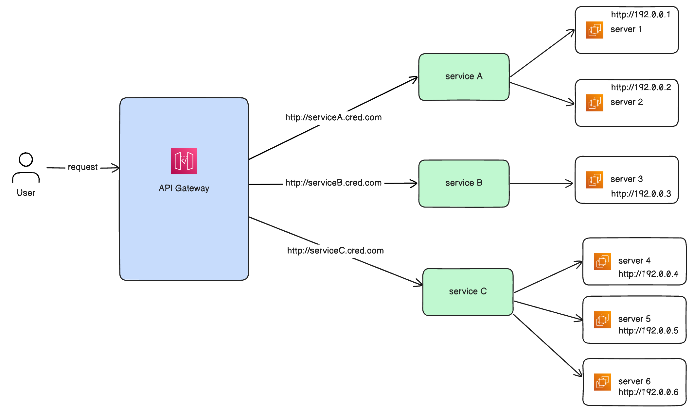

# Gateway & Load Balancer
 

CRED wishes to implement its own gateway and load balancer. We require your help in designing & implementation of a system with the following components:

### Gateway
Gateway would be responsible for various tasks like onboarding of services, server management, request validation, authentication, whitelisting, and load balancing.

### Service
Service is a microservice that can be onboarded to the gateway. Each service will be having a name and set of configs for request management. \
Each service can add an AuthConfig, which will help in authenticating the incoming requests.
AuthConfig has 2 fields enabled and authToken. enabled will enable the auth, authToken will be the token that needs to be validated for during authentication. \ 
WhitelistingConfig has 2 fields enabled and whitelistIps. enabled will enable the ip whitelisting, whitelistIps will be the list of IPs that needs to be validated for during whitelisting.

### Server
Server will be responsible for serving the requests coming to the gateway. Each server will be identified by its IP and each server will be attached to a service. A server can handle the requests only for that service it is attached to.
A Server can be registered to a service with the gateway, and also can be de-registered from the gateway.

### Load Balancer
Load Balancer will be responsible for routing the requests among the servers available for a particular service.

## Features to be designed in the system:

1. Service management:
   * Any new service can onboarded to the gateway
   * Each service will have the baseUrl with the name of the service
     * eg: if service name is serviceA, then baseUrl of the service will be http://serviceA.cred.com (or) https://serviceA.cred.com
     * Ensure each service has a unique name assigned to it.
     * Any service can be de-registered from the gateway (In case of deprecation of service)
2. Server management:
   * Allow adding of new servers. 
     * Each Server would be attached to a service
     * Each Server will be identified by its IP.
     * IP Of the Server must be unique
   * Once a server is assigned to a service, it cannot be used for any other service
   * Server dedicated to a service, should serve the traffic only for that service
   * Eg:
     * For serviceA, we can attach server1 with ip 130.0.0.1
     * Now for any requests coming to service1 can be served by server1
     * Each incoming request will have a request Url, which will help to find the service which this url should go to
     * A request with the following url: http://serviceB.cred.com/products cannot be served by server1 as it is assigned to serviceA
3. Request validation:
   * All the incoming requests would be validated by the gateway before sending them to the load balancer 
   * If the request URL is empty or invalid, return a 400 response with an appropriate error message.
   * If the request doesnot have a source ip, return 400 response with appropriate error message
4. Authentication:
   * Implement an auth config for each service:
     * If disabled, pass the request through. 
     * If enabled, authenticate the request using the auth token provided by the service:
       * If Auth token is valid, pass the request through.
       * If invalid, return a 401 response.
5. IP Whitelisting:
   * Implement a whitelisting config for each service:
     * If disabled, pass the request through.
     * If enabled, validate the request IP against the list of whitelisted IPs:
       * If valid, pass the request through.
       * If invalid, return a 403 response.
6. Request routing via Load Balancing:
   * Load Balancer will be responsible for routing the requests among the servers available for a particular service. Each service can dicate its own algorithm for routing the requests.
   * There are 2 algorithms supported for now:
     * Round Robin
     * Least Requests Served So Far

Please keep the following considerations into your design that:
* New configurations can be added in the future for a service like HttpsConfig, to listen only on https urls and reject other requests
* We can add new type of load balancing algorithms as per the service needs like weighted round robin
* We can add new services as we grow on the usecases

## Expectations
* You can implement the functionality in one of the programming languages (Java, Golang, Ruby, JS or Python)
* Please don’t create REST APIs or any UI for the same.
* You can test the functionality using unit test cases.
* The focus is on the core functionality and how it is implemented v/s how it is presented (UI or API structure).
* Please use the coding best practices (SOLID, DRY etc.) and ensure that you are writing modular & extensible code (to accommodate any future changes in functionality)
* The submitted code would be judged on both coding best practices and functional correctness.
